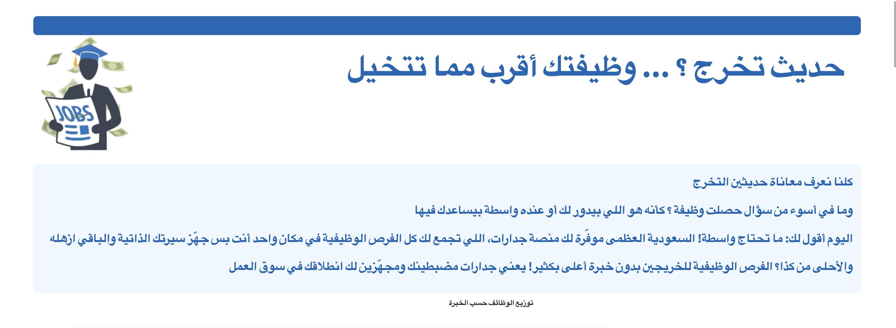

# تحليل بيانات جدارت - منصة تحليل الفرص الوظيفية
## حديث تخرج ؟ ... وظيفتك أقرب مما تتخيل


## مقدمة
مشروع( حديث تخرج ؟ ... وظيفتك أقرب مما تتخيل ) يهدف إلى تحليل الفرص الوظيفية لحديثي التخرج في 
المملكة العربية السعودية من البيانات المستخرجة من جدارات ، مع التركيز على تحليل الوظائف المتاحة، الرواتب، الفرص حسب الخبرة، والمناطق الجغرافية.

## المزايا الرئيسية
- عرض وتحليل عدد الوظائف المتاحة حسب مستوى الخبرة.
- تحليل تفصيلي للرواتب الخاصة بحديثي التخرج.
- تصنيف الفرص الوظيفية بناءً على الموقع الجغرافي.
- تقديم إحصاءات حول تصنيف الوظائف الأكثر طلبًا.
- مقارنة الرواتب في القطاعين الخاص وشبه الحكومي.
- تحليل توزيع الوظائف حسب الجنس.

## التقنيات المستخدمة
- **Streamlit**: لإنشاء واجهة تفاعلية وتقديم البيانات بشكل مرن وسهل الاستخدام.
- **Pandas**: لإجراء التحليلات والمعالجة المتقدمة للبيانات.
- **Plotly**: لإنشاء رسوم بيانية تفاعلية لعرض البيانات بشكل بصري.
- **CSS**: لتخصيص تصميم واجهة المستخدم وتحسين تجربة التفاعل.

## كيفية التشغيل
1. تأكد من أنك قد قمت بتثبيت المكتبات الضرورية:
    ```bash
    pip install streamlit pandas plotly
    ```

2. قم بتشغيل التطبيق باستخدام الأمر التالي:
    ```bash
    streamlit run app.py
    ```

3. سيتم فتح التطبيق في المتصفح الافتراضي على العنوان التالي:
    ```
    http://localhost:8501
    ```


## رابط المشروع
يمكنك الوصول إلى المشروع من خلال الرابط التالي: [مشروع تحليل بيانات جدارات ](https://emtnan06-usecase-5-app-gbfkem.streamlit.app).


## تطوير المشروع
تم تطوير هذا المشروع بواسطة [ امتنان العميريني](https://github.com/Emtnan06).

