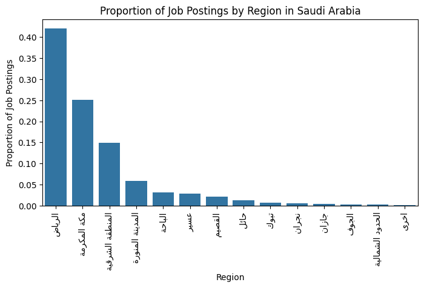
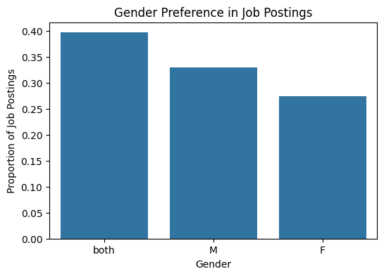
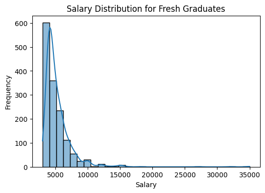
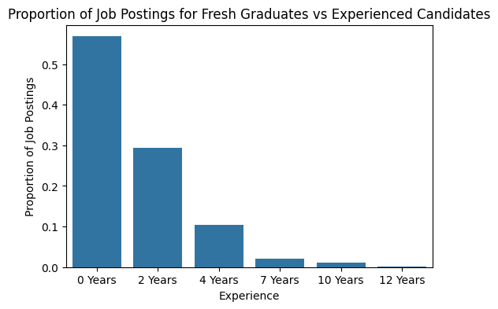

# **Job Postings Data Analysis in Saudi Arabia** 🎯

This project analyzes job postings data in Saudi Arabia, focusing on key trends such as **salaries**, **experience requirements**, **gender preferences**, and **regional distribution** of job opportunities.

---

## 🔍 **Project Overview**

We aimed to explore the following:
- **Job Postings by Region**: Identify the most active regions.
- **Gender Preferences**: Determine the gender distribution in job ads.
- **Salary Distribution for Fresh Graduates**: Analyze salary trends for fresh graduates.
- **Experience Requirements**: Compare fresh graduates’ vs experienced candidates' job opportunities.
- **Contract Types**: Understand the types of contracts being offered.

---

## 🛠️ **How It Works**

### **Data Cleaning & Preprocessing**
The data was cleaned to extract useful information, including:
- **Salary extraction** from benefits.
- **Experience conversion** into numerical values.
- **Job date formatting**.

### **Visualization & Analysis**
The insights were visualized using **Streamlit**, and the following were explored:
- **Job postings by region**: Riyadh leads, followed by Makkah.
- **Gender preference**: Majority of postings are gender-neutral.
- **Salary**: Fresh graduates earn between **5000 to 10000 SAR** on average.
- **Experience**: A higher proportion of job postings are for fresh graduates.
- **Contract types**: Most jobs are full-time.

---

## 🚀 **Run the Project**

1. Install dependencies:
    ```bash
    pip install streamlit pandas seaborn matplotlib st_vizzu
    ```

2. Run the Streamlit app:
    ```bash
    streamlit run app.py
    ```

Alternatively, you can view the live project online here: [Streamlit Job Postings Data Analysis](https://usecase-5mushal.streamlit.app/#4d75a39d)

---

## 🎨 **Visualizations**

- **Proportion of Job Postings by Region**
    

- **Gender Preference in Job Postings**
    

- **Salary Distribution for Fresh Graduates**
    

- **Proportion of Job Postings for Fresh Graduates vs Experienced Candidates**
    

---

## 💬 **Conclusion**

- **Riyadh** and **Makkah** dominate the job market.
- **Fresh graduates** represent a significant portion of job opportunities, with **salaries ranging from 5000 to 10000 SAR**.
- **Full-time** positions are more common than remote ones.

This analysis provides valuable insights for job seekers and employers alike, highlighting trends in salaries, experience, and regional job availability.
